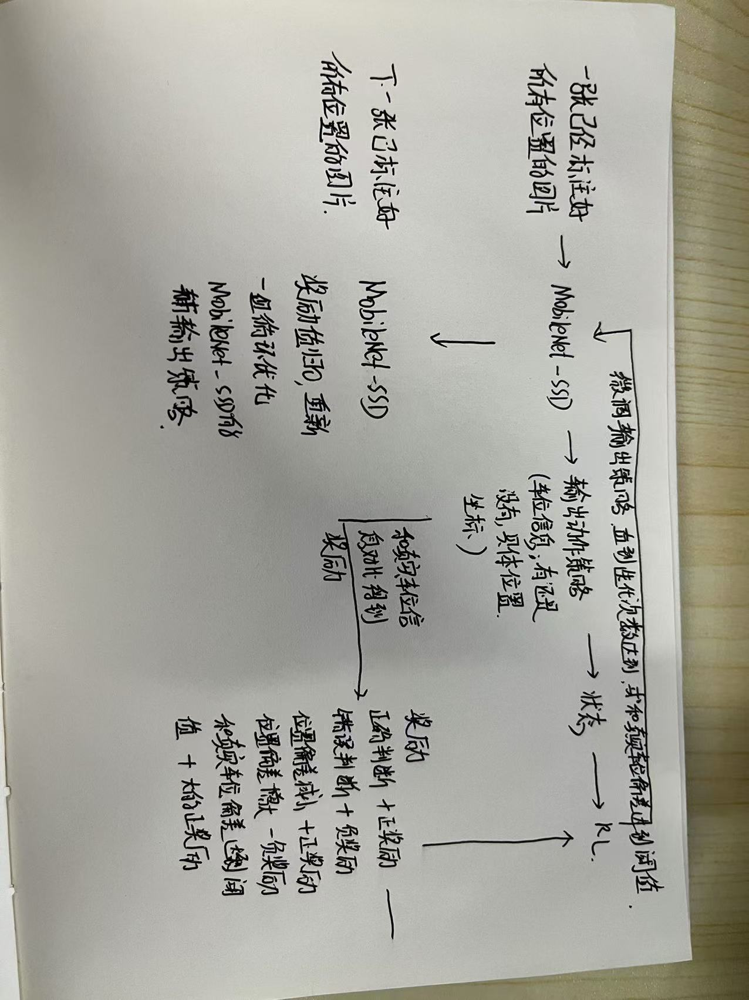

# 基于强化学习的停车位检测系统

## 系统概述
本系统使用深度学习结合强化学习方法，实现了智能停车位检测功能。系统通过不断学习和优化，能够准确识别停车位的占用状态。

## 系统架构
根据图片所示，系统主要包含以下组件：

### 1. 输入层
- 原始停车位图像数据
- 基于MobileNet-SSD的目标检测预处理

### 2. 特征提取模块
系统提取以下关键特征：
- 车辆检测结果（基于MobileNet-SSD）
- 图像特征（边缘、颜色等）
- 历史状态信息
- 其他相关特征（阴影、纹理等）

### 3. 强化学习模块
强化学习部分采用了以下设计：

#### 状态空间
- 车辆检测重叠率
- 边缘特征比率
- 阴影特征比率
- 历史占用情况
- 相邻车位状态信息

#### 动作空间
- 占用 (Occupied)
- 空闲 (Empty)

#### 奖励设计
- 基于检测置信度的奖励
- 状态切换惩罚
- 历史一致性奖励

#### 学习算法
- 采用Q-learning算法
- ε-贪婪策略进行探索
- 经验回放机制

### 4. 输出决策
- 停车位占用状态判断
- 置信度评估
- 可视化展示

## 代码实现特点

### 1. 核心类设计
- `ParkingSpace`: 停车位基础类，包含空间信息和状态历史
- `RLAgent`: 强化学习代理，实现Q-learning算法
- `ParkingDetector`: 主检测器，整合各个模块

### 2. 强化学习实现
```python
class RLAgent:
    def __init__(self, learning_rate=0.1, discount_factor=0.9, epsilon=0.1):
        self.learning_rate = learning_rate     # 学习率
        self.discount_factor = discount_factor # 折扣因子
        self.epsilon = epsilon                 # 探索率
```

### 3. 特征提取
- 车辆检测重叠特征
- 边缘密度特征
- 颜色和阴影特征
- 历史状态特征

### 4. 状态更新机制
- Q值实时更新
- 经验数据持久化
- 自适应学习机制

### 5. 可视化和监控
- 实时显示检测结果
- Q值统计和记录
- 日志记录系统

## 系统优势
1. 自适应学习能力
2. 历史经验利用
3. 鲁棒性强
4. 可持续优化

## 使用说明

### 环境要求
```
python >= 3.6
opencv-python
numpy
```

### 运行方式
```bash
python reinforcement_learning.py
```

### 配置说明
- `confidence_threshold`: 检测置信度阈值
- `learning_rate`: 强化学习率
- `epsilon`: 探索率
- `discount_factor`: 折扣因子

## 注意事项
1. 首次运行需要一定时间进行学习
2. Q表会自动保存，可累积经验
3. 可通过调整参数优化性能
4. GPU加速需要CUDA支持

## 改进方向
1. 添加深度强化学习(DQN)支持
2. 优化奖励函数设计
3. 引入优先经验回放
4. 添加多步学习机制
5. 实现在线学习功能

## 参考资料
- MobileNet-SSD论文
- Q-learning算法
- PKLot数据集说明

## 维护说明

